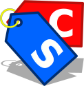

<!-- ## CUPON STORE -->
# <div align="center" style="color:#11bbcc;"><strong >  CUPON STORE </strong></div>

**```Descripción de la aplicacion```**

<!-- Cabecera -->
# Header
## Header
### Header
####  Header
#####  Header
######  Header

``` 
Cualquier 
```

<!-- Esta es una lista desondenada -->
- first
- second
- third

<!-- Lista Ordenada -->
1. uno
2. dos
3. tres


> div

<!-- linea separadora -->
***

<!-- Negrita -->
**aaa**

<!-- Italica -->
*aaaa*

<!-- link -->
[text](https://link)

<!-- Imagen -->
